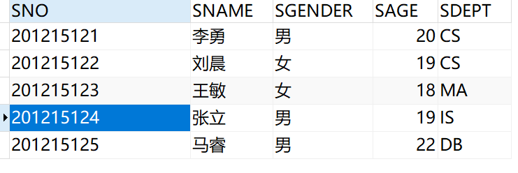
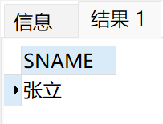
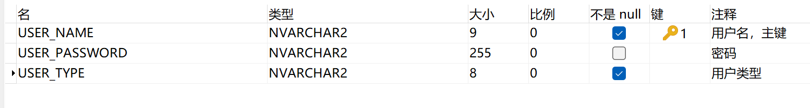
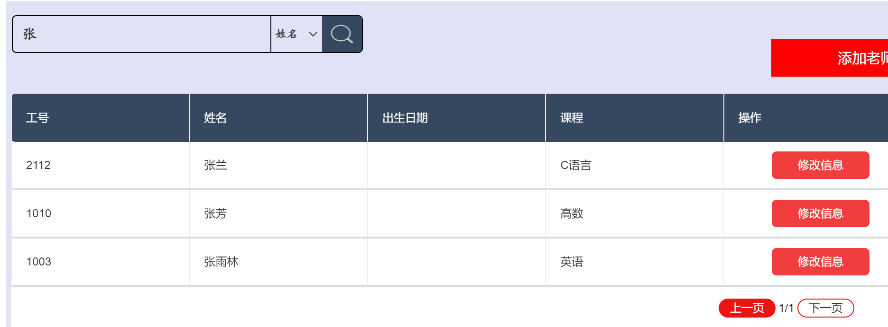

[TOC]


# 实验一：SQL定义功能、数据插入


1. 建立教学数据库的三个基本表（需添加PK、FK、Unique、Not NULL、Check约束）：

   S(Sno,Sname,Sgender,Sage,Sdept)  学生（学号，姓名，性别，年龄，系） 

   SC(Sno,Cno,Grade)       选课（学号，课程号，成绩）

   C(Cno,Cname,Cpno,Ccredit)   课程（课程号，课程名，先行课，学分）

2. DROP TABLE、ALTER TABLE、CREATE INDEX、DROP INDEX 及INSERT语句输入数据。


```sql
-- Student(Sno,Sname,Sgender,Sage,Sdept)

DROP TABLE Test;
CREATE TABLE Student
(
    Sno     CHAR(9)
        CONSTRAINT PK_Sno PRIMARY KEY,
    Sname   VARCHAR2(20)
        CONSTRAINT U_Sname UNIQUE,
    Sgender CHAR(4)
        CONSTRAINT C_Sgender CHECK (Sgender IN ('男', '女')),
    Sage    SMALLINT
        CONSTRAINT C_Sage CHECK (Sage > 0),
    Sdept   VARCHAR2(20)
);


-- Course(Cno,Cname,Cpno,Ccredit)
CREATE TABLE Course
(
    Cno     VARCHAR2(4)
        CONSTRAINT PK_Cno PRIMARY KEY,
    Cname   VARCHAR2(40)
        CONSTRAINT NN_Cname NOT NULL,
    Cpno    VARCHAR2(4),
    Ccredit SMALLINT
        CONSTRAINT C_Ccredit CHECK (Ccredit > 0),
    CONSTRAINT FK_Cno FOREIGN KEY (Cpno) REFERENCES Course(Cno)
);


-- SC(Sno,Cno,Grade)
CREATE TABLE SC
(
    Sno   CHAR(9),
    Cno   VARCHAR2(4),
    Grade SMALLINT 
        CONSTRAINT C_Grade CHECK (Grade >= 0 AND Grade <= 100),
    CONSTRAINT PK_Sno_Cno PRIMARY KEY (Sno, Cno),
    CONSTRAINT FK_SCSno FOREIGN KEY (Sno) REFERENCES Student(Sno),
    CONSTRAINT FK_SCCno FOREIGN KEY (Cno) REFERENCES Course(Cno)
);


-- DESC Student;

-- select * from user_tab_columns where Table_Name='Student';

ALTER TABLE Student
    ADD SBirth DATE;
ALTER TABLE Student
    DROP COLUMN SBirth;

--CREATE UNIQUE INDEX StuSno ON Student (Sno); Oracle会为 Primary key 和 unique 自动添加unique index索引，索引名是约束名
--CREATE UNIQUE INDEX CouCno ON Course (Cno);
CREATE UNIQUE INDEX SCno ON SC(Sno ASC, Cno DESC);
DROP INDEX SCno;

/* 
SELECT INDEX_NAME, INDEX_TYPE, TABLE_OWNER, TABLE_NAME, UNIQUENESS
FROM USER_INDEXES
WHERE TABLE_NAME = 'STUDENT'
   OR TABLE_NAME = 'COURSE'
   OR TABLE_NAME = 'SC';
*/


INSERT INTO Student
VALUES ('201215121', '李勇', '男', 20, 'CS');
INSERT INTO Student
VALUES ('201215122', '刘晨', '女', 19, 'CS');
INSERT INTO Student
VALUES ('201215123', '王敏', '女', 18, 'MA');
INSERT INTO Student
VALUES ('201215124', '张立', '男', 19, 'IS');
INSERT INTO Student 
VALUES ('201215125', '马睿', '男', 22, 'DB');


INSERT INTO Course (CNO, CNAME, CCREDIT)
VALUES (2, '数学', 2);
INSERT INTO Course  (CNO, CNAME, CCREDIT)
VALUES (6, '数据处理', 2);
INSERT INTO Course
VALUES (7, 'PASCAL 语言', 6, 4);
INSERT INTO Course
VALUES (4, '操作系统', 6, 3);
INSERT INTO Course
VALUES (5, '数据结构', 7, 3);
INSERT INTO Course
VALUES (1, '数据库', 5, 3);
INSERT INTO Course
VALUES (3, '信息系统', 1, 3);


INSERT into sc values('201215121', '1', 92);
INSERT into sc values('201215121', '2', 85);
INSERT into sc values('201215121', '3', 88);
INSERT into sc values('201215121', '4', 59);
INSERT into sc values('201215121', '5', 71);
INSERT into sc values('201215121', '6', 69);
INSERT into sc values('201215121', '7', 75);

INSERT into sc values('201215122', '1', 85);
INSERT into sc values('201215122', '3', 80);
INSERT into sc values('201215122', '5', 90);

INSERT into sc values('201215123', '2', 75);
INSERT into sc values('201215123', '4', 55);
INSERT into sc values('201215123', '6', 62);

INSERT into sc values('201215124', '1', 91);
INSERT into sc values('201215124', '4', 83);
INSERT into sc values('201215124', '5', 74);
INSERT into sc values('201215124', '7', 99);
COMMIT;
```

Course：


Student：




SC：


# 实验二：数据查询

1．查询选修1号课程的学生学号与姓名。

```SQL
SELECT
	sno,
	sname 
FROM
	student 
WHERE
	EXISTS ( SELECT * FROM sc scx WHERE scx.cno = '1' AND scx.sno = student.sno );
```


2．查询选修课程名为数据库原理的学生学号与姓名。

```sql
SELECT
	sno,
	sname 
FROM
	student 
WHERE
	EXISTS (
	SELECT
		* 
	FROM
		sc scx,
		course c 
	WHERE
		c.cname = '数据库' 
		AND c.cno = scx.cno 
	AND scx.sno = student.sno 
	);
```


3．查询不选1号课程的学生学号与姓名。

```sql
SELECT
	sno,
	sname 
FROM
	student 
WHERE
	NOT EXISTS ( SELECT * FROM sc scx WHERE scx.sno = student.sno AND scx.cno = '1' );
```


4．查询学习全部课程学生姓名。

```sql
SELECT
	sname 
FROM
	student 
WHERE
	NOT EXISTS (
	SELECT
		* 
	FROM
		course c 
	WHERE
	NOT EXISTS ( SELECT * FROM sc scx WHERE scx.sno = student.sno AND scx.cno = c.cno ) 
	);
```


5．查询所有学生除了选修1号课程外所有成绩均及格的学生的学号和平均成绩，其结果按平均成绩的降序排列。

没有选修1号课程的学生

```sql
SELECT
	* 
FROM
	(
	SELECT
		sno 
	FROM
		student 
	WHERE
		NOT EXISTS ( SELECT * FROM sc scx WHERE scx.sno = student.sno AND scx.cno = '1' ) 
	) NATURAL JOIN sc;
```


且所有成绩均及格的学生

```sql
SELECT
	sno,
	avg( GRADE ) avgGrade
FROM
	(
	SELECT
		* 
	FROM
		(
		SELECT
			sno 
		FROM
			student 
		WHERE
			NOT EXISTS ( SELECT * FROM sc scx WHERE scx.sno = student.sno AND scx.cno = '1' ) 
		)
		NATURAL JOIN sc 
	) 
GROUP BY
	SNO 
HAVING
	MIN( grade ) >= 60 
ORDER BY avgGrade DESC;
```


6．查询选修数据库原理成绩第2名的学生姓名。

```SQL
SELECT
	SNAME 
FROM
	(
	SELECT
		grade,
		sno,
		dense_rank ( ) over ( ORDER BY grade DESC ) ranking 
	FROM
		( SELECT * FROM course WHERE cname = '数据库' )
		NATURAL JOIN sc 
	)
	NATURAL JOIN STUDENT 
WHERE
	ranking = 2;
```




7．查询所有3个学分课程中有3门以上（含3门）课程获80分以上（含80分）的学生的姓名。

选出学分是3，且分数都是80以上的选课信息：

```sql
SELECT
	* 
FROM
	( SELECT * FROM course WHERE ccredit = 3 )
	NATURAL JOIN sc 
WHERE
	grade >= 80;
```


且学生选课的数量大于等于3的学生姓名：

```sql
SELECT
	sname 
FROM
	( SELECT * FROM ( SELECT * FROM course WHERE ccredit = 3 ) NATURAL JOIN sc WHERE grade >= 80 )
	NATURAL JOIN STUDENT 
GROUP BY
	sname 
HAVING
	count( * ) >= 3;
```


8．查询选课门数唯一（即与其他同学选修课程数目都不同）的学生的学号。

每个学生的选课门数及其学号（包括没有选课的学生）：

```sql
SELECT
	count( * ) sccount,
	sno 
FROM
	sc 
GROUP BY
	sno
UNION
SELECT
	0,
	sno 
FROM
	( SELECT sno FROM student MINUS SELECT sno FROM sc GROUP BY sno );
```


不存在一个学生的选课门数与另一个学生的选课门数相同且学号不同（去除了 选课门数相同且学号相同 的情况）

```sql
SELECT
	sno 
FROM
	(
	SELECT
		count( * ) sccount,
		sno 
	FROM
		sc 
	GROUP BY
		sno UNION
	SELECT
		0,
		sno 
	FROM
		( SELECT sno FROM student MINUS SELECT sno FROM sc GROUP BY sno ) 
	) tx 
WHERE
	NOT EXISTS (
	SELECT
		* 
	FROM
		(
		SELECT
			count( * ) sccount,
			sno 
		FROM
			sc 
		GROUP BY
			sno UNION
		SELECT
			0,
			sno 
		FROM
			( SELECT sno FROM student MINUS SELECT sno FROM sc GROUP BY sno ) 
		) ty 
	WHERE
		ty.sccount = tx.sccount 
	AND ty.sno != tx.sno 
	);
```


9．SELECT语句中各种子查询条件的实验。

前面的语句中都有涉及到。


# 实验三：数据修改、删除


1．把1号课程的非空成绩提高10％（建立触发器，当所更新成绩超过100分时设置成100）。

```sql
CREATE 
	OR REPLACE TRIGGER LIMIT_GRADE before UPDATE ON sc FOR each ROW
BEGIN
	IF
		: NEW.GRADE > 100 THEN
			: NEW.GRADE := 100;
		dbms_output.put_line ( '已将成绩设置为100' );
		
	END IF;
END;
set serveroutput on;
```

更新前：


更新后：

```sql
UPDATE sc 
SET grade = grade * 1.1 
WHERE
	cno = '1' 
	AND grade IS NOT NULL;
```


然后恢复数据


2．在SC表中删除课程名为数据库原理的成绩的元组。

删除前：


删除后：

```sql
DELETE 
FROM
	sc 
WHERE
	cno = ( SELECT cno FROM course WHERE cname = '数据库' );
```


然后恢复数据

```sql
INSERT into sc values('201215121', '1', 92);
INSERT into sc values('201215122', '1', 85);
INSERT into sc values('201215124', '1', 91);
```


3．在S和SC表中删除学号为201215121的所有数据（分是否使用cascade两种方式实现）。


不使用cascade：

删除前：


删除后：

```sql
delete from sc where sno = '201215121';
delete from student where sno = '201215121';
```

```sql
select * from sc where sno = '201215121';
select * from student where sno = '201215121';
```


如果先删除student表中的数据，会报错：


恢复数据：

```sql
INSERT INTO Student
VALUES ('201215121', '李勇', '男', 20, 'CS');

INSERT into sc values('201215121', '1', 92);
INSERT into sc values('201215121', '2', 85);
INSERT into sc values('201215121', '3', 88);
INSERT into sc values('201215121', '4', 59);
INSERT into sc values('201215121', '5', 71);
INSERT into sc values('201215121', '6', 69);
INSERT into sc values('201215121', '7', 75);
```


使用cascade：

删除前：


删除后：

```sql
alter table sc drop constraint FK_SCSno;
alter table sc add CONSTRAINT FOREIGN KEY (Sno) REFERENCES FK_SCSno Student(Sno) ON DELETE CASCADE;
delete from student where sno = '201215121';
```

```sql
select * from sc where sno = '201215121';
select * from student where sno = '201215121';
```


恢复数据


# 实验四：视图的操作


1．建立张姓学生的视图，属性包括学号、姓名、选修课程名和成绩。

```sql
CREATE OR REPLACE VIEW zhang AS SELECT
sno,
sname,
cname,
grade 
FROM
	student
	NATURAL LEFT JOIN sc
	NATURAL LEFT JOIN course 
WHERE
	sname LIKE '张%';
	
select * from zhang;
```


2．在男学生视图中查询平均成绩大于80分的学生学号与姓名。

创建男学生视图：

```sql
CREATE OR REPLACE VIEW male AS SELECT
sno,
sname,
grade 
FROM
	student
	NATURAL LEFT JOIN sc
WHERE
	sgender = '男';
```


查询平均成绩大于80分的学生学号与姓名：

```sql
SELECT DISTINCT
	sno,
	sname 
FROM
	male 
WHERE
	sno IN ( SELECT sno FROM male GROUP BY sno HAVING avg( grade ) > 80 );
```


3．创建计算机系CS的学生视图，并对该视图进行增删改查操作（要求只能操作CS数据）。

创建计算机系CS的学生视图：

```sql
CREATE 
	OR REPLACE VIEW cs AS SELECT
	* 
FROM
	student 
WHERE
	sdept = 'CS' WITH CHECK OPTION;

select * from cs;
```


增：

```SQL
insert into cs values('201215126', '张三', '女', 21, 'CS');
select * from cs;
```


```SQL
insert into cs values('201215127', '李四', '女', 21, 'IS');
```


删：

```SQL
delete from cs where sname = '张三';
select * from cs;
```


改：

```SQL
update cs set sgender = '女' where sname = '李勇';
select * from cs;
update cs set sgender = '男' where sname = '李勇';
```


```SQL
update cs set sdept = 'IS';
```


查：

```SQL
select * from cs where sage > 19;
```


# 实验五：库函数，授权控制


1．计算每个学生有成绩的课程门数、平均成绩并报表输出(要求创建过程实现)。

```sql
CREATE 
	OR REPLACE PROCEDURE experiment_5_1 IS BEGIN
		FOR ROW IN ( SELECT sno, avg( grade ) avggrade, count( grade ) coursecount FROM student NATURAL JOIN sc GROUP BY sno )
		loop
		dbms_output.put_line ('学号：' || ROW.sno || '  平均成绩：' || ROW.avggrade || '  课程门数：' || ROW.coursecount );
	
END loop;

END experiment_5_1;
/

set serveroutput on;
begin
	experiment_5_1;
end;
/
```


2．给定学生学号，查询其选修成绩最高的那门课的课程名（要求创建函数实现）。

```sql
CREATE 
	OR REPLACE FUNCTION experiment_5_2 
	( in_sno IN CHAR ) 
	RETURN sys_refcursor 
	IS out_cname sys_refcursor;
BEGIN
	OPEN out_cname FOR SELECT
		cname 
	FROM
		( SELECT * FROM sc NATURAL JOIN course WHERE sno = in_sno ) 
	WHERE
		grade = ( SELECT max( grade ) FROM sc WHERE sno = in_sno );
	RETURN out_cname;
	
END experiment_5_2;
/ 


set serveroutput on;
DECLARE
out_cname sys_refcursor;
cname VARCHAR ( 20 );
BEGIN
	out_cname := experiment_5_2 ( '201215121' );
	LOOP
	FETCH out_cname INTO cname;
	EXIT WHEN out_cname % NOTFOUND;
	dbms_output.put_line ( cname );
	
END LOOP;
END;
/
```


3．将选修表中成绩为NULL的选修记录删除，成绩为55-60之间的改成60分（要求使用游标实现）。

```sql
CREATE 
	OR REPLACE PROCEDURE experiment_5_3 
	IS 
	CURSOR C1 
	IS 
		SELECT sno, cno 
		FROM sc 
		WHERE grade IS NULL;
		
	CURSOR C2 
	IS 
		SELECT sno, cno
		FROM sc 
		WHERE grade BETWEEN 55 AND 60;
		
	cursor_sno CHAR ( 9 );
	cursor_cno VARCHAR2 ( 4 );
BEGIN
	OPEN C1;
	LOOP
		FETCH C1 INTO cursor_sno, cursor_cno;
		EXIT WHEN C1 % NOTFOUND;
		DELETE 
		FROM
			sc 
		WHERE
			sno = cursor_sno 
			AND cno = cursor_cno;
	END LOOP;
	CLOSE C1;
	
	OPEN C2;
	LOOP
		FETCH C2 INTO cursor_sno, cursor_cno;
		EXIT WHEN C2 % NOTFOUND;
		UPDATE sc 
		SET
			grade = 60 
		WHERE
			sno = cursor_sno 
			AND cno = cursor_cno;
	END LOOP;
	CLOSE C2;

COMMIT;
END experiment_5_3;
/
```


插入两条成绩为空的数据：

```sql
insert into sc values('201215122', '7', NULL);
insert into sc values('201215125', '7', NULL);
```


调用过程：

```sql
set serveroutput on;
BEGIN
	experiment_5_3;
END;
/
```


4．使用GRANT语句，把对基本表S、SC、C的使用权限授给其它用户。

先使用sysdba用户：

```sql
GRANT ALL PRIVILEGES TO marui WITH admin OPTION;
```

再使用marui用户：

```sql
GRANT ALL PRIVILEGES ON student TO scott;
GRANT ALL PRIVILEGES ON sc TO scott;
GRANT ALL PRIVILEGES ON course TO scott;
```


最后使用scott用户：


5．实验完成后，撤消建立的基本表和视图。

```sql
DROP VIEW cs;
DROP VIEW male;
DROP VIEW zhang;

DROP TRIGGER LIMIT_GRADE;

DROP PROCEDURE experiment_5_1;
DROP PROCEDURE experiment_5_3;
DROP FUNCTION experiment_5_2;

DROP TABLE student cascade constraints;
DROP TABLE course cascade constraints;
DROP TABLE sc cascade constraints;
```


# 实验六：实现一个小型管理信息系统


## 一、实验平台

操作系统：Windows 11

开发工具：SpringBoot + Mybatis + IntelliJ IDEA

数据库：Oracle 19c

系统开发语言：Java


## 二、系统介绍

本系统功能模块划分：

### (1) 对数据的浏览模块


#### 学生端

1. 查看个人信息
2. 查看存在课程（已录入教务处的课程）
3. 查看课表
4. 查看个人成绩


#### 老师端

1. 查看个人信息
2. 查看选课信息（哪些学生选了这个老师负责的课程）
3. 查看学生成绩（这个老师负责的课程相关成绩）


#### 管理员端

1. 查看系统使用用户
2. 查看所有学生信息
3. 查看所有教师信息
4. 查看所有课程信息
5. 查看所有学生选课信息
6. 查看所有学生成绩


### (2) 对数据的查询模块


#### 学生端

1. 登录


#### 老师端

1. 登录
2. 根据学号/姓名/班级查询学生选课信息
3. 根据学号/姓名/班级查询学生成绩


#### 管理员端

1. 登录
2. 根据用户名 或 用户名 + 用户类型(老师/学生/管理员)查询系统使用用户
3. 根据学号/姓名/班级查询学生信息
4. 根据工号/姓名查询教师信息
5. 根据课程名/课程号查询课程信息
6. 根据学号/班级查询选课信息
7. 根据学号/学生姓名/教师名/课程名查询学生成绩


### (3) 对数据的添加模块


#### 学生端

学生选课


#### 教师端

无


#### 管理员端

1. 添加老师
2. 添加学生
3. 添加课程

其中操作1、2的同时也添加了系统使用者。


### (4) 对数据的修改模块


#### 学生端

1. 修改个人信息
2. 修改密码
3. 忘记密码(然后修改密码)


#### 老师端

1. 修改个人信息
2. 修改密码
3. 修改学生成绩


#### 管理员端

1. 修改/删除系统使用者信息
2. 修改/删除学生信息
3. 修改/删除教师信息
4. 修改/删除系统使用者密码
5. 修改/删除课程信息
6. 修改学生成绩


## 三、数据库部分

### 系统E-R图


### 系统关系表


#### COURSE表


#### SCORE表


#### STUDENT表


#### STUSER表




#### TEACHER表


#### CLASSTIME表


## 四、实验步骤


(1) 建立数据库及数据

```sql
CREATE TABLE STUSER
(
	USER_NAME NVARCHAR2(9)
	  constraint PK_USERNAME PRIMARY KEY,
	USER_PASSWORD NVARCHAR2(255),
	USER_TYPE NVARCHAR2(8) NOT NULL
    --不能加外键约束在username上，因为有admin这一个特殊用户
);

CREATE TABLE STUDENT (
	STUDENT_NAME NVARCHAR2 ( 10 ) NOT NULL,
	STUDENT_SNO NVARCHAR2 ( 9 ) constraint PK_STUDENTSNO PRIMARY KEY,
	STUDENT_AGE SMALLINT constraint C_STUDENTAGE CHECK ( STUDENT_AGE > 0 AND STUDENT_AGE < 100 ),
	STUDENT_DATE DATE,
	STUDENT_PHONE CHAR ( 11 ) NOT NULL,
	STUDENT_ADDRESS NVARCHAR2 ( 30 ),
	STUDENT_CLASS NVARCHAR2 ( 8 ) NOT NULL
);

CREATE TABLE COURSE (
	COURSE_NAME NVARCHAR2 ( 15 ) NOT NULL,
	COURSE_CNO NVARCHAR2 ( 9 ) constraint PK_COURSECNO PRIMARY KEY,
	COURSE_INFORMATION NVARCHAR2 ( 20 )
);

CREATE TABLE TEACHER (
	TEACHER_NAME NVARCHAR2 ( 10 ) NOT NULL,
	TEACHER_TNO NVARCHAR2 ( 9 ) constraint PK_TEACHERTNO PRIMARY KEY,
	TEACHER_AGE SMALLINT constraint C_TEACHERAGE CHECK ( TEACHER_AGE > 0 AND TEACHER_AGE < 100 ),
	TEACHER_DATE DATE,
	TEACHER_PHONE CHAR ( 11 ) NOT NULL,
	TEACHER_ADDRESS NVARCHAR2 ( 30 ),
	TEACH_COURSE_CNO NVARCHAR2 ( 9 ),
	constraint FK_TEACHCOURSECNO FOREIGN KEY(TEACH_COURSE_CNO) REFERENCES COURSE( COURSE_CNO )
);

CREATE TABLE CLASSTIME (
	COURSE_CNO NVARCHAR2 ( 8 ),
	CLASS_WEEKEND SMALLINT constraint C_CLASSWEEKEND CHECK (CLASS_WEEKEND > 0 AND CLASS_WEEKEND < 6) NOT NULL,
	CLASS_TIME SMALLINT constraint C_CLASSTIME CHECK (CLASS_TIME > 0 AND CLASS_TIME < 6) NOT NULL,
    constraint PK_CLASSTIME_COURSECNO PRIMARY KEY(COURSE_CNO),
     constraint FK_CLASSTIME_COURSECNO FOREIGN KEY(COURSE_CNO) REFERENCES COURSE(COURSE_CNO)
);

CREATE TABLE SCORE (
	STUDENT_SNO NVARCHAR2 ( 9 ) constraint FK_SCORE_STUDENTSNO REFERENCES STUDENT(STUDENT_SNO),
	COURSE_CNO NVARCHAR2 ( 8 ) constraint FK_SCORE_COURSECNO REFERENCES COURSE(COURSE_CNO),
	TEACHER_TNO NVARCHAR2 ( 9 ) constraint FK_SCORE_TEACHERTNO REFERENCES TEACHER(TEACHER_TNO),
	SCORE NUMBER(6, 2) constraint C_SCORE CHECK(SCORE >= 0 AND SCORE <= 100),
	SCORE_ID NVARCHAR2 ( 32 ) constraint PK_SCOREID PRIMARY KEY
);

INSERT INTO STUDENT VALUES ('23523', '235235', 22, TO_DATE('1999-12-3', 'yy-mm-dd'), '13891345217', '南京', '软件3班');
INSERT INTO STUDENT VALUES ('lp', '20170235', 22, TO_DATE('1999-12-24', 'yy-mm-dd'), '13556989457', '四川成都', '软件5班');
INSERT INTO STUDENT VALUES ('xw', '20170239', 1, TO_DATE('2018-06-23', 'yy-mm-dd'), '13529465698', 'asdas', '软件4班');
INSERT INTO STUDENT VALUES ('lk', '20170535', 20, TO_DATE('1998-11-17', 'yy-mm-dd'), '13598768569', 'fsdfsdf', '软件5班');
INSERT INTO STUDENT VALUES ('zys', '20170135', 2, TO_DATE('2017-08-05', 'yy-mm-dd'), '17798768569', '四川成都', '软件4班');
INSERT INTO STUDENT VALUES ('xw', '20170158', 21, TO_DATE('1998-08-05', 'yy-mm-dd'), '17765489685', '四川成都温江', '软件3班');
INSERT INTO STUDENT VALUES ('yt', '20171115', 21, TO_DATE('1998-09-05', 'yy-mm-dd'), '17765483659', '四川成都温江', '软件3班');
INSERT INTO STUDENT VALUES ('zyp', '20170015', 22, TO_DATE('1997-09-05', 'yy-mm-dd'), '13709058698', '四川成都巴中', '软件1班');
INSERT INTO STUDENT VALUES ('hj', '20171525', 22, TO_DATE('1997-11-05', 'yy-mm-dd'), '13709058698', '四川洛枳', '软件2班');
INSERT INTO STUDENT VALUES ('sw', '20170003', 21, TO_DATE('1998-11-05', 'yy-mm-dd'), '13782659253', '四川洛枳', '软件2班');
INSERT INTO STUDENT VALUES ('12345678', '12345678', 21, TO_DATE('1998-01-01', 'yy-mm-dd'), '15982014077', 'asdadasd', 'qwewq');
INSERT INTO STUDENT VALUES ('20170898', '20170898', 21, TO_DATE('1998-01-01', 'yy-mm-dd'), '15982014077', 'asdadasd', 'qwewq');
INSERT INTO STUDENT VALUES ('20170002', '20170002', 22, TO_DATE('1997-08-07', 'yy-mm-dd'), '13789658256', '四川温江', '运维2班');

INSERT INTO COURSE VALUES ('语文', '0001', '一个文学的语言');
INSERT INTO COURSE VALUES ('高数', '0011', '数学要求高精确低错误');
INSERT INTO COURSE VALUES ('英语', '0002', '英语好啊，强啊');
INSERT INTO COURSE VALUES ('java', '1012', '计算机编程基础');
INSERT INTO COURSE VALUES ('C语言', '1013', '计算机编程入门');
INSERT INTO COURSE VALUES ('CSS', '1103', '界面前端样式');
INSERT INTO COURSE VALUES ('CSS3', '1011', '前端样式学习');
INSERT INTO COURSE VALUES ('HTML 5', '2011', '跨平台界面实现');
INSERT INTO COURSE VALUES ('python', '0301', '人工智能');
INSERT INTO COURSE VALUES ('微信小程序开发', '1102', '微信界面嵌入式开发');
INSERT INTO COURSE VALUES ('VUE', 'da', 'asd');

INSERT INTO CLASSTIME VALUES ('0001', 3, 4);
INSERT INTO CLASSTIME VALUES ('0011', 3, 2);
INSERT INTO CLASSTIME VALUES ('0002', 2, 3);
INSERT INTO CLASSTIME VALUES ('1012', 1, 4);
INSERT INTO CLASSTIME VALUES ('1013', 1, 5);
INSERT INTO CLASSTIME VALUES ('1103', 4, 3);
INSERT INTO CLASSTIME VALUES ('1011', 5, 4);
INSERT INTO CLASSTIME VALUES ('2011', 2, 5);
INSERT INTO CLASSTIME VALUES ('0301', 3, 5);
INSERT INTO CLASSTIME VALUES ('1102', 2, 1);
INSERT INTO CLASSTIME VALUES ('da', 1, 2);

INSERT INTO TEACHER VALUES ('刘飞', '1001', 35, TO_DATE('1984-10-07', 'yy-mm-dd'), '13578943654', '四川成都', '0001');
INSERT INTO TEACHER VALUES ('张芳', '1010', 38, TO_DATE('1983-12-09', 'yy-mm-dd'), '17789654563', '四川德阳', '0011');
INSERT INTO TEACHER VALUES ('张雨林', '1003', 30, TO_DATE('1989-11-02', 'yy-mm-dd'), '17762536398', '四川德阳', '0002');
INSERT INTO TEACHER VALUES ('lp', '1004', 30, TO_DATE('1989-11-10', 'yy-mm-dd'), '17565398456', '四川成都', '1013');
INSERT INTO TEACHER VALUES ('xw', '1005', 35, TO_DATE('1984-08-06', 'yy-mm-dd'), '13706598634', '四川绵阳', '1012');
INSERT INTO TEACHER VALUES ('ly', '1011', 36, TO_DATE('1983-08-01', 'yy-mm-dd'), '17765973265', '成都温江', '1103');
INSERT INTO TEACHER VALUES ('nl', '1012', 35, TO_DATE('1984-08-01', 'yy-mm-dd'), '13765973265', '湖南张家界', '1103');
INSERT INTO TEACHER VALUES ('何兰', '2012', 29, TO_DATE('1990-08-01', 'yy-mm-dd'), '13765954369', '四川成都温江', '0002');
INSERT INTO TEACHER VALUES ('张兰', '2112', 26, TO_DATE('1993-08-01', 'yy-mm-dd'), '13765954569', '四川成都郫县', '1013');
INSERT INTO TEACHER VALUES ('魅蓝', '2212', 28, TO_DATE('1991-08-01', 'yy-mm-dd'), '13798762315', '山西太原', '1013');
INSERT INTO TEACHER VALUES ('赵霞', '2312', 27, TO_DATE('1992-08-01', 'yy-mm-dd'), '17798152315', '山东广西', '1102');
INSERT INTO TEACHER VALUES ('FM', '2323', 27, TO_DATE('1994-08-31', 'yy-mm-dd'), '17798151253', '广西', '0301');

INSERT INTO SCORE VALUES ('20170235', '0001', '1001', 90, '1                               ');
INSERT INTO SCORE VALUES ('20170235', '0011', '1010', 80, '2                               ');
INSERT INTO SCORE VALUES ('20170239', '0001', '1001', 80, '3                               ');
INSERT INTO SCORE VALUES ('20170003', '1102', '1010', 86, '4                               ');
INSERT INTO SCORE VALUES ('20170003', '1103', '1012', 93, '5                               ');
INSERT INTO SCORE VALUES ('20170003', '1013', '2212', 59, '6                               ');
INSERT INTO SCORE VALUES ('20171115', '1103', '1012', 89, '7                               ');
INSERT INTO SCORE VALUES ('20170235', '1013', '1004', 100, '8                               ');
INSERT INTO SCORE VALUES ('20170235', '0002', '2012', 0, '9                               ');
INSERT INTO SCORE VALUES ('20170235', '1012', '1005', 0, '10                              ');
INSERT INTO SCORE VALUES ('20170003', '0001', '1001', 11, '11                              ');
INSERT INTO SCORE VALUES ('20170003', '0011', '1010', 0, '12                              ');
INSERT INTO SCORE VALUES ('20170003', '0002', '2012', 0, '13                              ');
INSERT INTO SCORE VALUES ('20171115', '0011', '1010', 0, '14                              ');

INSERT INTO STUSER VALUES ('admin', '9f81d20a9a1d77195dc7537c87ef9b3b', '管理员');
INSERT INTO STUSER VALUES ('20170235', '9f81d20a9a1d77195dc7537c87ef9b3b', '学生');
INSERT INTO STUSER VALUES ('20170239', '9f81d20a9a1d77195dc7537c87ef9b3b', '学生');
INSERT INTO STUSER VALUES ('20170535', '9f81d20a9a1d77195dc7537c87ef9b3b', '学生');
INSERT INTO STUSER VALUES ('1001', '9f81d20a9a1d77195dc7537c87ef9b3b', '教师');
INSERT INTO STUSER VALUES ('1010', '9f81d20a9a1d77195dc7537c87ef9b3b', '教师');
INSERT INTO STUSER VALUES ('1003', '9f81d20a9a1d77195dc7537c87ef9b3b', '教师');
INSERT INTO STUSER VALUES ('1004', '9f81d20a9a1d77195dc7537c87ef9b3b', '教师');
INSERT INTO STUSER VALUES ('1005', '9f81d20a9a1d77195dc7537c87ef9b3b', '教师');
INSERT INTO STUSER VALUES ('20170135', '9f81d20a9a1d77195dc7537c87ef9b3b', '学生');
INSERT INTO STUSER VALUES ('20170158', '9f81d20a9a1d77195dc7537c87ef9b3b', '学生');
INSERT INTO STUSER VALUES ('20171115', '9f81d20a9a1d77195dc7537c87ef9b3b', '学生');
INSERT INTO STUSER VALUES ('20170015', '9f81d20a9a1d77195dc7537c87ef9b3b', '学生');
INSERT INTO STUSER VALUES ('20171525', '9f81d20a9a1d77195dc7537c87ef9b3b', '学生');
INSERT INTO STUSER VALUES ('20170003', '9f81d20a9a1d77195dc7537c87ef9b3b', '学生');
INSERT INTO STUSER VALUES ('1011', '9f81d20a9a1d77195dc7537c87ef9b3b', '教师');
INSERT INTO STUSER VALUES ('1012', '9f81d20a9a1d77195dc7537c87ef9b3b', '教师');
INSERT INTO STUSER VALUES ('2012', '9f81d20a9a1d77195dc7537c87ef9b3b', '教师');
INSERT INTO STUSER VALUES ('2112', '9f81d20a9a1d77195dc7537c87ef9b3b', '教师');
INSERT INTO STUSER VALUES ('2212', '9f81d20a9a1d77195dc7537c87ef9b3b', '教师');
INSERT INTO STUSER VALUES ('2312', '9f81d20a9a1d77195dc7537c87ef9b3b', '教师');
INSERT INTO STUSER VALUES ('2323', '9f81d20a9a1d77195dc7537c87ef9b3b', '教师');
INSERT INTO STUSER VALUES ('12345678', '9f81d20a9a1d77195dc7537c87ef9b3b', '学生');
INSERT INTO STUSER VALUES ('20170898', '9f81d20a9a1d77195dc7537c87ef9b3b', '学生');
INSERT INTO STUSER VALUES ('20170002', '9f81d20a9a1d77195dc7537c87ef9b3b', '学生');
INSERT INTO STUSER VALUES ('235235', '9f81d20a9a1d77195dc7537c87ef9b3b', '学生');
```

(2) 编写程序

(3) 用 IntelliJ IDEA 编译

(4) 运行试用


## 五、实验结果


### 登录界面


### 学生端

#### 查看个人信息


#### 查看选修课程


#### 查看成绩


#### 修改个人信息

原先地址是四川成都，已经更改为甘肃兰州


#### 选课，选修英语


### 教师端

#### 查看个人信息


#### 查看课程信息


#### 查看学生成绩


#### 修改个人信息

原先没有出生日期，现在添加了1999-12-24的出生日期


#### 查询学生选课信息

查询学号为20170003的学生选课信息


#### 查询学生成绩

查询学号为20170235的学生成绩信息


### 管理员端

#### 查看登录用户


#### 查看学生信息


#### 查看教师信息


#### 查看课程信息


#### 查看选课信息


#### 查看学生成绩


#### 修改登录用户

删除用户名为2017525的用户


#### 修改学生信息

修改前，学号为12345678的学生姓名为12345678


修改后：姓名为Leslie，生日为1999-12-24


#### 修改教师信息

修改前，工号为2212的老师姓名为魅蓝


修改后：姓名为懂王，生日为1978-3-4


#### 修改课程信息

修改数学课的时间及其课程描述

修改前：


修改后：


#### 修改学生成绩

修改前：


修改后：


#### 查询学生信息

按学号模糊搜索


#### 查询教师信息

按姓名模糊搜索




#### 查询课程信息

按课程号模糊搜索


#### 查询选课信息

按班级精确搜索


#### 查询学生成绩

按教师姓名精确查询


## 六、实验源代码

这里只附上数据操作的相关代码，具体的逻辑代码和页面显示代码过多不宜展示

### AdministorDaoMapper.xml

```xml
<?xml version="1.0" encoding="UTF-8"?>
<!DOCTYPE mapper PUBLIC "-//mybatis.org//DTD Mapper 3.0//EN"
        "http://mybatis.org/dtd/mybatis-3-mapper.dtd">
<!-- namespace创建命名空间 -->
<mapper namespace="com.onlineclass.dao.AdministorDao">
    <!-- 显示或查询所有用户 -->

    <!-- 查询user/student表的信息 -->
    <resultMap id="AdminSel" type="com.onlineclass.pojo.User">
        <!-- column是数据表中的,property是pojo的数据类型 -->
        <id column="user_name" property="user_name"/>
        <result column="user_password" property="user_password"/>
        <result column="user_type" property="user_type"/>
    </resultMap>
    <select id="AdminUser" resultMap="AdminSel">
        SELECT * from stuser where
        1=1
        <if test="user_name!=''and user_name!=null">
            and stuser.user_name=#{user_name}
        </if>
        <if test="user_type!=''and user_type!=null">
            and stuser.user_type=#{user_type}
        </if>
    </select>
    <!-- 分页显示用户信息 -->
    <select id="AdminUserPage" resultMap="AdminSel">
        select * from (SELECT stuser.*, rownum rn from stuser where
        1=1
        <if test="user_name!=''and user_name!=null">
            and user_name=#{user_name}
        </if>
        <if test="user_type!=''and user_type!=null">
            and user_type=#{user_type}
        </if>) t
        where t.rn between ${(pageNo-1)*pageSize} and ${pageNo*pageSize}
    </select>

    <!-- 修改用户类型 -->
    <update id="AdminUpdateUser" parameterType="User">
        UPDATE stuser
        set user_type=#{user_type}
        where user_name = #{user_name}
    </update>
    <!-- 删除用户 -->
    <delete id="AdminDelUser" parameterType="User">
        DELETE
        from stuser
        where user_name = #{user_name}
    </delete>
</mapper>
```


### ClassTimeMapper.xml

```xml
<?xml version="1.0" encoding="UTF-8"?>
<!DOCTYPE mapper PUBLIC "-//mybatis.org//DTD Mapper 3.0//EN"
        "http://mybatis.org/dtd/mybatis-3-mapper.dtd">
<!-- namespace创建命名空间 -->
<mapper namespace="com.onlineclass.dao.ClassTimeDao">
    <!-- 添加课程时间信息 -->
    <insert id="InsertClassTime" parameterType="ClassTime">
        INSERT into classtime(course_cno, class_weekend, class_time)
        values (#{course_cno}, #{class_weekend}, #{class_time})
    </insert>

    <!-- 查询选课时间 -->
    <select id="classTimes" resultType="ClassTime">
        SELECT * from classtime where 1=1
        <if test="course_cno!='' and course_cno!=null">
            and course_cno=#{course_cno}
        </if>
        <if test="class_weekend!=0 and class_time!=0">
            and (class_weekend=#{class_weekend} and class_time=#{class_time})
        </if>

    </select>

    <!-- 删除选课时间 -->
    <delete id="DelClassTime" parameterType="ClassTime">
        DELETE
        from classtime
        where 1 = 1
          and course_cno = #{course_cno}
    </delete>

    <!-- 修改选课时间 -->
    <update id="UpdateClassTime" parameterType="ClassTime">
        UPDATE classtime
        set class_weekend=#{class_weekend},
            class_time=#{class_time}
        where course_cno = #{course_cno}
    </update>

</mapper>
```


### CourseDaoMapper.xml

```xml
<?xml version="1.0" encoding="UTF-8"?>
<!DOCTYPE mapper PUBLIC "-//mybatis.org//DTD Mapper 3.0//EN"
        "http://mybatis.org/dtd/mybatis-3-mapper.dtd">
<!-- namespace创建命名空间 -->
<mapper namespace="com.onlineclass.dao.CourseDao">
    <!-- 查询两个表的信息 -->
    <resultMap id="coursesSels"
               type="com.onlineclass.pojo.Teacher">
        <!-- column是数据表中的,property是pojo的数据类型 -->
        <id column="teacher_tno" property="teacher_tno"/>
        <result column="teacher_name" property="teacher_name"/>
        <result column="teacher_age" property="teacher_age"/>
        <result column="teacher_date" property="teacher_date"/>
        <result column="teacher_phone" property="teacher_phone"/>
        <result column="teacher_address" property="teacher_address"/>
        <association property="course"
                     javaType="com.onlineclass.pojo.Course">
            <id column="course_cno" property="course_cno"/>
            <result column="course_name" property="course_name"/>
            <result column="course_information"
                    property="course_information"/>
            <association property="classTime"
                         javaType="com.onlineclass.pojo.ClassTime">
                <id column="course_cno" property="course_cno"/>
                <result column="class_weekend" property="class_weekend"/>
                <result column="class_time" property="class_time"/>
            </association>
        </association>
    </resultMap>
    <!-- 分页显示课程 -->
    <select id="coursesSelPage" resultMap="coursesSels">
        SELECT * from teacher,course,classtime where
        teacher.teacher_course_id=course.course_cno
        and 1=1
        and
        classtime.course_cno=course.course_cno
        <if test="course_name!=''and course_name!=null">
            and course.course_name like concat(concat('%',#{course_name}),'%')
        </if>
        <if test="course_cno!=''and course_cno!=null">
            and course.course_cno like concat(concat('%',#{course_cno}),'%')
        </if>
        <if test="teacher_name!=''and teacher_name!=null">
            and teacher.teacher_name like
            concat(concat('%',#{teacher_name}),'%')
        </if>
        and rownum &lt; ${pageNo*pageSize}

        minus

        SELECT * from teacher,course,classtime where
        teacher.teacher_course_id=course.course_cno
        and 1=1
        and
        classtime.course_cno=course.course_cno
        <if test="course_name!=''and course_name!=null">
            and course.course_name like concat(concat('%',#{course_name}),'%')
        </if>
        <if test="course_cno!=''and course_cno!=null">
            and course.course_cno like concat(concat('%',#{course_cno}),'%')
        </if>
        <if test="teacher_name!=''and teacher_name!=null">
            and teacher.teacher_name like
            concat(concat('%',#{teacher_name}),'%')
        </if>
        and rownum &lt; ${(pageNo-1)*pageSize}


    </select>

    <!-- 显示所有课程 -->
    <select id="coursesSel" resultMap="coursesSels">
        SELECT * from teacher,course,classtime where
        teacher.teacher_course_id=course.course_cno
        and 1=1
        and
        classtime.course_cno=course.course_cno
        <if test="course_name!=''and course_name!=null">
            and course.course_name like concat(concat('%',#{course_name}),'%')
        </if>
        <if test="course_cno!=''and course_cno!=null">
            and course.course_cno like concat(concat('%',#{course_cno}),'%')
        </if>
        <if test="teacher_name!=''and teacher_name!=null">
            and teacher.teacher_name like
            concat(concat('%',#{teacher_name}),'%')
        </if>
    </select>


    <!-- 查询三个表的信息 -->
    <resultMap id="scoreSels" type="com.onlineclass.pojo.Score">
        <!-- column是数据表中的,property是pojo的数据类型 -->
        <id column="score_id" property="score_id"/>
        <result column="score" property="scores"/>
        <collection property="student"
                    ofType="com.onlineclass.pojo.Student">
            <id column="student_sno" property="student_sno"/>
            <result column="student_name" property="student_name"/>
            <result column="student_age" property="student_age"/>
            <result column="student_date" property="student_date"/>
            <result column="student_phone" property="student_phone"/>
            <result column="student_address" property="student_address"/>
            <result column="student_class" property="student_class"/>
        </collection>
        <collection property="teacher"
                    ofType="com.onlineclass.pojo.Teacher">
            <id column="teacher_tno" property="teacher_tno"/>
            <result column="teacher_name" property="teacher_name"/>
            <result column="teacher_age" property="teacher_age"/>
            <result column="teacher_date" property="teacher_date"/>
            <result column="teacher_phone" property="teacher_phone"/>
            <result column="teacher_address" property="teacher_address"/>
        </collection>
        <collection property="course"
                    ofType="com.onlineclass.pojo.Course">
            <id column="course_cno" property="course_cno"/>
            <result column="course_name" property="course_name"/>
            <result column="course_information"
                    property="course_information"/>
            <collection property="classTime"
                        ofType="com.onlineclass.pojo.ClassTime">
                <id column="course_cno" property="course_cno"/>
                <result column="class_weekend" property="class_weekend"/>
                <result column="class_time" property="class_time"/>
            </collection>
        </collection>
        <!-- <collection property="course" column="course_cno" select="getCourse"
            ofType="com.onlineclass.pojo.Course" /> <collection property="teacher" column="teacher_tno"
            select="getTeacher" ofType="com.onlineclass.pojo.Teacher" /> -->
    </resultMap>
    <!--显示成绩信息 -->
    <select id="scores" resultMap="scoreSels">
        select * from score,student,teacher,course,classtime where
        score.student_sno=student.student_sno and score.teacher_tno=teacher.teacher_tno and
        score.course_cno=course.course_cno and classtime.course_cno=course.course_cno and 1=1
        <if test="student_sno!=''and student_sno!=null">
            and score.student_sno=#{student_sno}
        </if>
        <if test="course_cno!=''and course_cno!=null">
            and course.course_cno=#{course_cno}
        </if>
        <if test="teacher_tno!=''and teacher_tno!=null">
            and score.teacher_tno=#{teacher_tno}
        </if>
    </select>

    <!--分页显示成绩信息 -->
    <select id="scoresPage" resultMap="scoreSels">
        select * from score,student,teacher,course,classtime where
        score.student_sno=student.student_sno
        and
        score.teacher_tno=teacher.teacher_tno
        and
        score.course_cno=course.course_cno
        and
        classtime.course_cno=course.course_cno
        and 1=1
        <if test="student_sno!=''and student_sno!=null">
            and score.student_sno=#{student_sno}
        </if>
        <if test="course_cno!=''and course_cno!=null">
            and score.course_cno=#{course_cno}
        </if>
        <if test="teacher_tno!=''and teacher_tno!=null">
            and score.teacher_tno=#{teacher_tno}
        </if>
        and rownum &lt; ${pageNo*pageSize}

        minus

        select * from score,student,teacher,course,classtime where
        score.student_sno=student.student_sno
        and
        score.teacher_tno=teacher.teacher_tno
        and
        score.course_cno=course.course_cno
        and
        classtime.course_cno=course.course_cno
        and 1=1
        <if test="student_sno!=''and student_sno!=null">
            and score.student_sno=#{student_sno}
        </if>
        <if test="course_cno!=''and course_cno!=null">
            and score.course_cno=#{course_cno}
        </if>
        <if test="teacher_tno!=''and teacher_tno!=null">
            and score.teacher_tno=#{teacher_tno}
        </if>
        and rownum &lt; ${(pageNo-1)*pageSize}

    </select>


    <!--显示学生成绩信息 -->
    <select id="scoresStu" resultMap="scoreSels">
        select * from score,student,teacher,course,classtime where
        score.student_sno=student.student_sno
        and
        score.teacher_tno=teacher.teacher_tno
        and
        score.course_cno=course.course_cno
        and
        classtime.course_cno=course.course_cno
        and 1=1
        <if test="student_sno!=''and student_sno!=null">
            and score.student_sno=#{student_sno}
        </if>
        <if test="student_name!=''and student_name!=null">
            and student.student_name like concat(concat('%',#{student_name}),'%')
        </if>
        <if test="teacher_name!=''and teacher_name!=null">
            and teacher.teacher_name like concat(concat('%',#{teacher_name}),'%')
        </if>
        <if test="course_name!=''and course_name!=null">
            and course.course_name like concat(concat('%',#{course_name}),'%')
        </if>
    </select>

    <!--分页显示学生成绩信息 -->
    <select id="scoresStuPage" resultMap="scoreSels">
        select * from score,student,teacher,course,classtime where
        score.student_sno=student.student_sno
        and
        score.teacher_tno=teacher.teacher_tno
        and
        score.course_cno=course.course_cno
        and
        classtime.course_cno=course.course_cno
        and 1=1
        <if test="student_sno!=''and student_sno!=null">
            and score.student_sno=#{student_sno}
        </if>
        <if test="student_name!=''and student_name!=null">
            and student.student_name like concat(concat('%',#{student_name}),'%')
        </if>
        <if test="teacher_name!=''and teacher_name!=null">
            and teacher.teacher_name like concat(concat('%',#{teacher_name}),'%')
        </if>
        <if test="course_name!=''and course_name!=null">
            and course.course_name like concat(concat('%',#{course_name}),'%')
        </if>
        and rownum &lt; ${pageNo*pageSize}

        minus

        select * from score,student,teacher,course,classtime where
        score.student_sno=student.student_sno
        and
        score.teacher_tno=teacher.teacher_tno
        and
        score.course_cno=course.course_cno
        and
        classtime.course_cno=course.course_cno
        and 1=1
        <if test="student_sno!=''and student_sno!=null">
            and score.student_sno=#{student_sno}
        </if>
        <if test="student_name!=''and student_name!=null">
            and student.student_name like concat(concat('%',#{student_name}),'%')
        </if>
        <if test="teacher_name!=''and teacher_name!=null">
            and teacher.teacher_name like concat(concat('%',#{teacher_name}),'%')
        </if>
        <if test="course_name!=''and course_name!=null">
            and course.course_name like concat(concat('%',#{course_name}),'%')
        </if>
        and rownum &lt; ${(pageNo-1)*pageSize}

    </select>


    <resultMap id="coursesPage"
               type="com.onlineclass.pojo.Course">
        <id column="course_cno" property="course_cno"/>
        <result column="course_name" property="course_name"/>
        <result column="course_information"
                property="course_information"/>
        <association property="classTime"
                     javaType="com.onlineclass.pojo.ClassTime">
            <id column="course_cno" property="course_cno"/>
            <result column="class_weekend" property="class_weekend"/>
            <result column="class_time" property="class_time"/>
        </association>
    </resultMap>

    <!-- 查询课程所有信息 -->
    <select id="getCourse" resultMap="coursesPage">
        SELECT * from course,classtime where
        1=1
        and course.course_cno=classtime.course_cno
        <if test="course_cno!=''and course_cno!=null">
            and course.course_cno like concat(concat('%',#{course_cno}),'%')
        </if>
        <if test="course_name!=''and course_name!=null">
            and course.course_name like concat(concat('%',#{course_name}),'%')
        </if>
    </select>
    <!-- 分页显示课程信息 -->
    <select id="getCoursePages" resultMap="coursesPage">
        SELECT * from course,classtime where
        1=1
        and course.course_cno=classtime.course_cno
        <if test="course_cno!=''and course_cno!=null">
            and course.course_cno like concat(concat('%',#{course_cno}),'%')
        </if>
        <if test="course_name!=''and course_name!=null">
            and course.course_name like concat(concat('%',#{course_name}),'%')
        </if>
        and rownum &lt; ${pageNo*pageSize}

        minus

        SELECT * from course,classtime where
        1=1
        and course.course_cno=classtime.course_cno
        <if test="course_cno!=''and course_cno!=null">
            and course.course_cno like concat(concat('%',#{course_cno}),'%')
        </if>
        <if test="course_name!=''and course_name!=null">
            and course.course_name like concat(concat('%',#{course_name}),'%')
        </if>
        and rownum &lt; ${(pageNo-1)*pageSize}


    </select>

    <!-- 修改课程信息 -->
    <update id="coursesUpdate" parameterType="Course">
        UPDATE course
        set course_name=#{course_name},
            course_information=#{course_information}
        where course_cno = #{course_cno}
    </update>

    <!-- 删除课程 -->
    <delete id="coursesDel" parameterType="Course">
        DELETE from course where 1=1
        <if test="course_cno!=''and course_cno!=null">
            and course_cno=#{course_cno}
        </if>
    </delete>

    <!-- 添加课程 -->
    <insert id="coursesInsert" parameterType="Course">
        INSERT into course(course_name, course_cno, course_information)
        values (#{course_name}, #{course_cno}, #{course_information})
    </insert>

</mapper>
```


### ScoreDaoMapper.xml

```xml
<?xml version="1.0" encoding="UTF-8"?>
<!DOCTYPE mapper PUBLIC "-//mybatis.org//DTD Mapper 3.0//EN"
	"http://mybatis.org/dtd/mybatis-3-mapper.dtd">
<!-- namespace创建命名空间 -->
<mapper namespace="com.onlineclass.dao.ScoreDao">
	<!-- 课程选择 -->
	<insert id="courseChange" parameterType="Score">
		INSERT into score(student_sno,course_cno,teacher_tno,score,score_id)
		values(#{student_sno},#{course_cno},#{teacher_tno},0,sys_guid())
	</insert>

	<!-- 课程查询 -->
	<select id="scoresSel" parameterType="Score" resultType="Score">
		SELECT * from score where
		1=1
		<if test="student_sno!=''and student_sno!=null">
			and student_sno=#{student_sno}
		</if>
		<if test="course_cno!=''and course_cno!=null">
			and course_cno=#{course_cno}
		</if>
	</select>

	<!-- 学生课程成绩录入 -->
	<update id="scoresInput" parameterType="Score">
		UPDATE Score set score=#{score} where student_sno=#{student_sno} and
		course_cno=#{course_cno}
	</update>

</mapper>
```


### StudentDaoMapper.xml

```xml
<?xml version="1.0" encoding="UTF-8"?>
<!DOCTYPE mapper PUBLIC "-//mybatis.org//DTD Mapper 3.0//EN"
        "http://mybatis.org/dtd/mybatis-3-mapper.dtd">
<!-- namespace创建命名空间 -->
<mapper namespace="com.onlineclass.dao.StudentDao">
    <!-- 查询所有学生,用于学生查询个人信息 -->
    <select id="SelStudent" resultType="Student">
        SELECT * from student where 1=1
        <if test="student_sno!='' and student_sno!=null">
            and student_sno like concat(concat('%',#{student_sno}),'%')
        </if>
        <if test="student_name!='' and student_name!=null">
            and student_name like concat(concat('%',#{student_name}),'%')
        </if>
        <if test="student_class!='' and student_class!=null">
            and student_class like concat(concat('%',#{student_class}),'%')
        </if>
    </select>

    <!-- 分页显示学生信息,老师使用 -->
    <select id="SelStudentPage" resultType="Student">
        select * from (SELECT student.*, rownum rn from student where 1=1
        <if test="student_sno!='' and student_sno!=null">
            and student_sno like concat(concat('%',#{student_sno}),'%')
        </if>
        <if test="student_name!='' and student_name!=null">
            and student_name like concat(concat('%',#{student_name}),'%')
        </if>
        <if test="student_class!='' and student_class!=null">
            and student_class like concat(concat('%',#{student_class}),'%')
        </if>) t
        where t.rn between ${(pageNo-1)*pageSize} and ${pageNo*pageSize}
    </select>


    <!-- 修改学生信息,用于学生&管理员修改个人信息 -->
    <update id="UpdataStudent" parameterType="Student">
        update student set
        student_name=#{student_name},student_sno=#{student_sno},student_age=#{student_age},student_date=#{student_date},student_phone=#{student_phone},
        student_address=#{student_address},student_class=#{student_class} where student_sno=#{student_sno}
    </update>
    <!-- 删除学生信息 -->
    <delete id="DelStudent" parameterType="Student">
        DELETE from student where 1=1 and student_sno=#{student_sno}
    </delete>

</mapper>
```


### TeacherDaoMapper.xml

```xml
<?xml version="1.0" encoding="UTF-8"?>
<!DOCTYPE mapper PUBLIC "-//mybatis.org//DTD Mapper 3.0//EN"
        "http://mybatis.org/dtd/mybatis-3-mapper.dtd">
<!-- namespace创建命名空间 -->
<mapper namespace="com.onlineclass.dao.TeacherDao">

    <resultMap id="TeacherPage" type="com.onlineclass.pojo.Teacher">
        <!-- column是数据表中的,property是pojo的数据类型 -->
        <id column="teacher_tno" property="teacher_tno"/>
        <result column="teacher_name" property="teacher_name"/>
        <result column="teacher_age" property="teacher_age"/>
        <result column="teacher_date" property="teacher_date"/>
        <result column="teacher_phone" property="teacher_phone"/>
        <result column="teacher_address" property="teacher_address"/>
        <collection property="course" column="course_cno"
                    select="getCourse" ofType="com.onlineclass.pojo.Course"/>
    </resultMap>

    <!-- 查询所有教师,用于教师修改信息 -->
    <select id="SelTeacher" resultMap="TeacherPage">
        SELECT * from teacher,course where 1=1
        and
        teacher.teacher_course_id=course.course_cno
        <if test="teacher_name!='' and teacher_name!=''">
            and teacher_name like concat(concat('%',#{teacher_name}),'%')
        </if>
        <if test="teacher_tno!='' and teacher_tno!=null">
            and teacher_tno=#{teacher_tno}
        </if>
    </select>

    <!-- 分页查询所有教师 -->
    <select id="SelTeacherPage" resultMap="TeacherPage">
        SELECT * from teacher,course where 1=1
        and
        teacher.teacher_course_id=course.course_cno
        <if test="teacher_name!='' and teacher_name!=''">
            and teacher_name like concat(concat('%',#{teacher_name}),'%')
        </if>
        <if test="teacher_tno!='' and teacher_tno!=null">
            and teacher_tno=#{teacher_tno}
        </if>
        and rownum &lt; ${pageNo*pageSize}

        minus

        SELECT * from teacher,course where 1=1
        and
        teacher.teacher_course_id=course.course_cno
        <if test="teacher_name!='' and teacher_name!=''">
            and teacher_name like concat(concat('%',#{teacher_name}),'%')
        </if>
        <if test="teacher_tno!='' and teacher_tno!=null">
            and teacher_tno=#{teacher_tno}
        </if>
        and rownum &lt; ${(pageNo-1)*pageSize}


    </select>


    <!-- 查询所有教师,用于删除课程 -->
    <select id="SelTeacherss" resultMap="TeacherPage">
        SELECT *
        from teacher,
             course
        where teacher.teacher_course_id = #{course_cno}
    </select>


    <!-- 修改教师信息 -->
    <update id="UpdataTeacher" parameterType="Teacher">
        update teacher
        set teacher_name=#{teacher_name},
            teacher_tno=#{teacher_tno},
            teacher_age=#{teacher_age},
            teacher_date=#{teacher_date},
            teacher_phone=#{teacher_phone},
            teacher_address=#{teacher_address},
            teacher_course_id=#{teacher_course_id}
        where teacher_tno = #{teacher_tno}
    </update>

    <!-- 删除教师信息 -->
    <delete id="DelTeacher" parameterType="Teacher">
        DELETE
        from teacher
        where 1 = 1
          and teacher_tno = #{teacher_tno}
    </delete>

    <!-- 添加教师信息 -->
    <insert id="AddTeacher" parameterType="Teacher">
        INSERT into teacher(teacher_name, teacher_tno, teacher_age, teacher_date, teacher_phone, teacher_address,
                            teacher_course_id)
        values (#{teacher_name}, #{teacher_tno}, #{teacher_age}, #{teacher_date}, #{teacher_phone}, #{teacher_address},
                #{teacher_course_id})
    </insert>

    <!-- 查询三个表的信息 -->
    <resultMap id="TeacherChanges" type="com.onlineclass.pojo.Score">
        <!-- column是数据表中的,property是pojo的数据类型 -->
        <id column="score_id" property="score_id"/>
        <result column="score" property="scores"/>
        <collection property="student"
                    ofType="com.onlineclass.pojo.Student">
            <id column="student_sno" property="student_sno"/>
            <result column="student_name" property="student_name"/>
            <result column="student_age" property="student_age"/>
            <result column="student_date" property="student_date"/>
            <result column="student_phone" property="student_phone"/>
            <result column="student_address" property="student_address"/>
            <result column="student_class" property="student_class"/>
        </collection>
        <collection property="teacher"
                    ofType="com.onlineclass.pojo.Teacher">
            <id column="teacher_tno" property="teacher_tno"/>
            <result column="teacher_name" property="teacher_name"/>
            <result column="teacher_age" property="teacher_age"/>
            <result column="teacher_date" property="teacher_date"/>
            <result column="teacher_phone" property="teacher_phone"/>
            <result column="teacher_address" property="teacher_address"/>
        </collection>
        <collection property="course" column="course_cno"
                    select="getCourse" ofType="com.onlineclass.pojo.Course"/>
        <!--
    <association property="teacher" column="teacher_tno"
        select="getTeacher" javaType="com.onlineclass.pojo.Teacher" />
         -->
    </resultMap>
    <!--显示成绩信息,看哪些学生选了哪些属于该老师的课、还有成绩管理 -->
    <select id="scoresTeacherChange" resultMap="TeacherChanges">
        select * from score,student,teacher where 1=1
        and score.teacher_tno=teacher.teacher_tno
        and score.student_sno=student.student_sno
        <if test="teacher_tno!=''and teacher_tno!=null">
            and score.teacher_tno=#{teacher_tno}
        </if>
        <if test="student_sno!=''and student_sno!=null">
            and score.student_sno=#{student_sno}
        </if>
        <if test="student_name!=''and student_name!=null">
            and student.student_name like concat(concat('%',#{student_name}),'%')
        </if>
        <if test="student_class!=''and student_class!=null">
            and student.student_class like concat(concat('%',#{student_class}),'%')
        </if>
    </select>

    <!--分页显示成绩信息,看哪些学生选了哪些属于该老师的课、还有成绩管理 -->
    <select id="scoresTeacherChangePage" resultMap="TeacherChanges">
        select * from score,student,teacher where
        score.student_sno=student.student_sno
        and score.teacher_tno=teacher.teacher_tno
        and 1=1
        <if test="teacher_tno!=''and teacher_tno!=null">
            and score.teacher_tno=#{teacher_tno}
        </if>
        <if test="student_sno!=''and student_sno!=null">
            and score.student_sno=#{student_sno}
        </if>
        <if test="student_name!=''and student_name!=null">
            and student.student_name like concat(concat('%',#{student_name}),'%')
        </if>
        <if test="student_class!=''and student_class!=null">
            and student.student_class like concat(concat('%',#{student_class}),'%')
        </if>
        and rownum &lt; ${pageNo*pageSize}

        minus

        select * from score,student,teacher where
        score.student_sno=student.student_sno
        and score.teacher_tno=teacher.teacher_tno
        and 1=1
        <if test="teacher_tno!=''and teacher_tno!=null">
            and score.teacher_tno=#{teacher_tno}
        </if>
        <if test="student_sno!=''and student_sno!=null">
            and score.student_sno=#{student_sno}
        </if>
        <if test="student_name!=''and student_name!=null">
            and student.student_name like concat(concat('%',#{student_name}),'%')
        </if>
        <if test="student_class!=''and student_class!=null">
            and student.student_class like concat(concat('%',#{student_class}),'%')
        </if>
        and rownum &lt; ${(pageNo-1)*pageSize}

    </select>


    <!-- 查询课程所有信息 -->
    <select id="getCourse" resultType="Course">
        SELECT *
        from course
        where course_cno = #{course_cno}
    </select>

</mapper>
```


### UserDaoMapper.xml

```xml
<?xml version="1.0" encoding="UTF-8"?>
<!DOCTYPE mapper PUBLIC "-//mybatis.org//DTD Mapper 3.0//EN"
        "http://mybatis.org/dtd/mybatis-3-mapper.dtd">
<!-- namespace创建命名空间 -->
<mapper namespace="com.onlineclass.dao.UserDao">
    <!--用户登录 -->
    <select id="userLogin" resultType="User">
        SELECT *
        from stuser
        where user_name = #{user_name}
          and user_password = #{user_password}
          and user_type = #{user_type}
    </select>

    <!-- 用户注册 -->
    <insert id="userRegister" parameterType="User">
        INSERT into stuser(user_name, user_password, user_type)
        values (#{user_name}, #{user_password}, #{user_type})
    </insert>

    <!-- 判断用户是否已注册 -->
    <select id="useConflict" resultType="User">
        SELECT *
        from stuser
        where user_name = #{username}
    </select>

    <!-- 学生用户注册 -->
    <insert id="StudentRegister" parameterType="Student">
        INSERT into student(student_name, student_sno, student_age, student_date, student_phone, student_address,student_class)
        values (#{student_name}, #{student_sno}, #{student_age}, #{student_date}, #{student_phone}, #{student_address},#{student_class})
    </insert>

    <!-- 学生用户查询,可用于忘记密码 -->
    <select id="SelStudent" resultType="Student">
        SELECT *
        from student
        where 1 = 1
          and student_sno = #{studentSno}
          and student_phone = #{studentTelphone}
    </select>

    <!-- 用户修改 -->
    <update id="UpdataUser" parameterType="User">
        UPDATE stuser
        set user_password=#{user_password},
            user_type=#{user_type}
        where user_name = #{user_name}
    </update>

    <!-- 用户查询 -->
    <select id="SelUser" resultType="User">
        SELECT * from stuser where 1=1
        <if test="user_name!=''and user_name!=null">
            and user_name=#{user_name}
        </if>
    </select>

    <!-- 上面所有的都在UserController用到了-->

</mapper>

```

